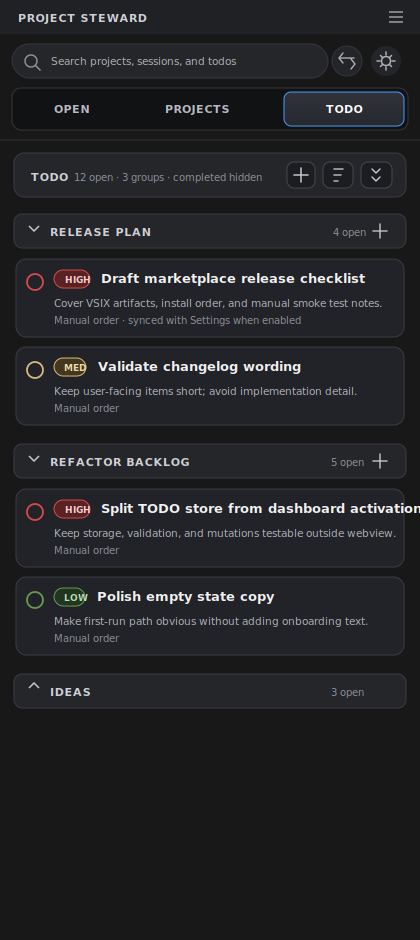
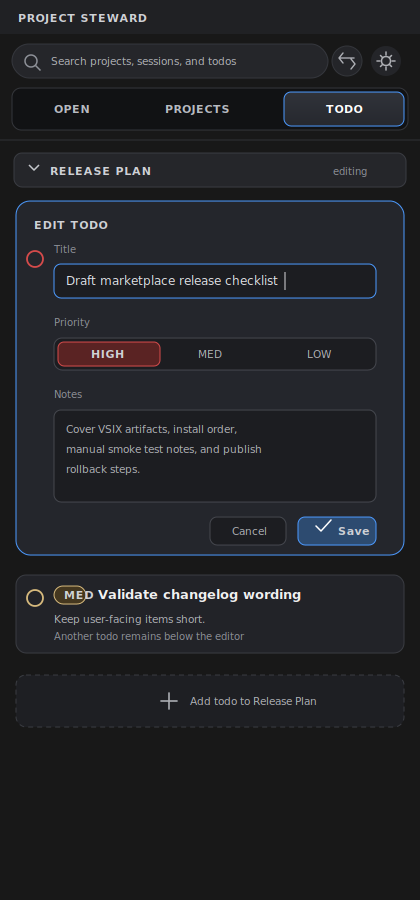
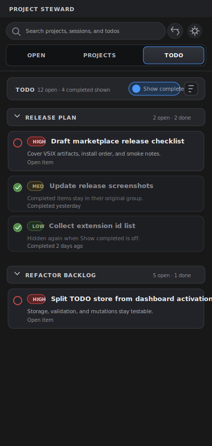
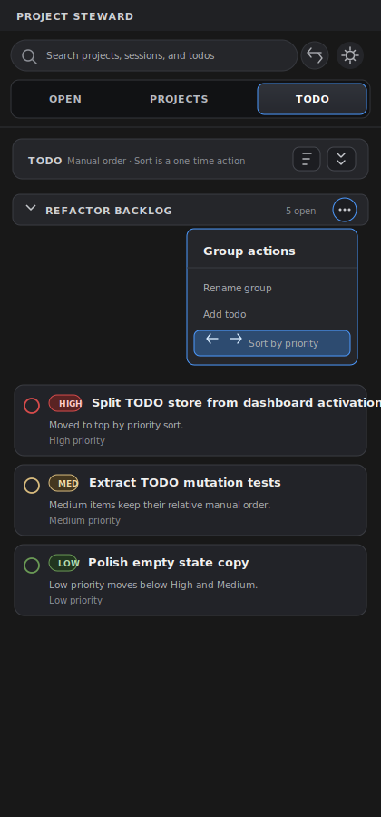
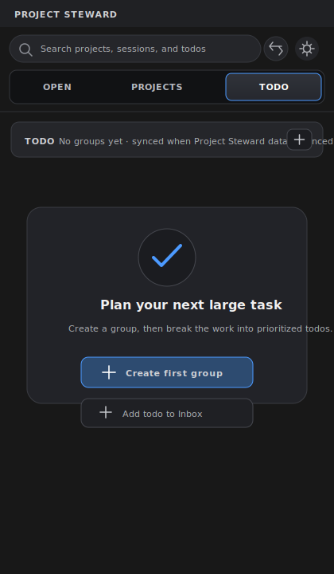
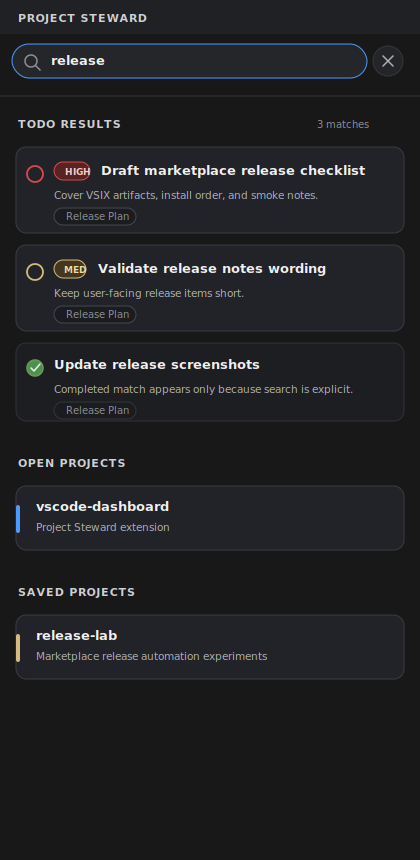

# Global TODO List PRD

日期：2026-07-16

状态：草案，待确认

## 1. 背景

Project Steward 已经通过 `OPEN` 和 `PROJECTS` 两个 Tab 分别承载当前工作状态和静态项目库。用户在使用 Codex、Claude、Kimi CLI 做较大任务时，常常需要一份跨窗口、跨机器可同步的规划清单，用来拆解后续工作、记录优先级和保留任务备注。

当前插件没有专门的全局规划区。项目卡片和 AI session 更适合表达“项目”和“对话”，不适合承载长期、跨项目的待办规划。本功能在现有 Dashboard 中新增第三个 `TODO` Tab，用于管理 Project Steward 级别的全局 TODO 列表。

## 2. 目标

- 在 `OPEN`、`PROJECTS` 右侧新增 `TODO` Tab。
- 提供一个全局 TODO 列表，不绑定具体项目。
- 支持较大的规划清单：分组、任务、备注、优先级、完成状态和排序。
- 在侧边栏内完成主要编辑操作，不依赖命令面板或手动 JSON 编辑。
- TODO 数据跟随现有 Project Steward 存储策略跨机器同步。
- 保持第一版简单可靠，不引入复杂协作或冲突合并模型。

## 3. 非目标

- 不做项目级 TODO；TODO 不关联 saved project、open project 或 workspace root。
- 不做 due date、提醒、日历、重复任务或时间估算。
- 不做 `Doing`、`Backlog` 等多阶段工作流；状态只区分未完成和完成。
- 不做 Markdown 渲染；备注是多行纯文本。
- 不做多人协作、任务分配或评论。
- 不做复杂跨机器冲突合并；第一版接受最后写入覆盖。
- 不新增独立 VS Code View；TODO 作为现有 Dashboard 的第三个 Tab。

## 4. 产品定位

`TODO` 回答的问题是：

> 我接下来要做哪些事，哪些最重要，哪些已经完成？

三个 Tab 的职责如下：

| Tab | 用户问题 | 内容性质 |
| --- | --- | --- |
| `OPEN` | 我现在打开了什么，当前 AI 工作进展如何？ | 实时、临时、窗口相关 |
| `PROJECTS` | 我保存了哪些项目，下一步要打开哪个？ | 静态、长期、项目资产 |
| `TODO` | 我全局规划了哪些任务，下一步先做什么？ | 静态、长期、任务规划 |

`TODO` 是 Project Steward 的全局规划清单，而不是某个项目的任务视图。

## 5. 页面入口

Tab 顺序固定为：

```text
OPEN    PROJECTS    TODO
```

- `TODO` 位于 `PROJECTS` 右侧。
- 进入 `TODO` 不自动加载 `PROJECTS` 内容。
- 搜索框、设置按钮和 sticky header 继续复用现有 Dashboard 顶部区域。
- 切换 Tab 时保留当前 Webview 生命周期内的滚动位置。
- `TODO` Tab 不显示 attention 红点或 AI session 数量。

默认列表效果：



## 6. 数据模型

### 6.1 Todo Group

每个 TODO 分组包含：

```ts
interface TodoGroup {
  id: string;
  title: string;
  todoIds: string[];
  createdAt: string;
  updatedAt: string;
}
```

规则：

- `id` 由扩展生成，稳定且不依赖标题。
- `title` 不能为空；用户未输入时使用 `Untitled Group`。
- `todoIds` 表示该组内的手动排序。
- 分组排序由顶层 group 数组顺序决定。

### 6.2 Todo Item

每个 TODO 项包含：

```ts
type TodoPriority = 'high' | 'medium' | 'low';

interface TodoItem {
  id: string;
  groupId: string;
  title: string;
  notes: string;
  priority: TodoPriority;
  completed: boolean;
  createdAt: string;
  updatedAt: string;
  completedAt?: string;
}
```

规则：

- `title` 不能为空；空标题不能保存。
- `notes` 是纯文本，可以为空，可以多行。
- `priority` 默认 `medium`。
- `completed=false` 表示未完成；`completed=true` 表示完成。
- 完成项不会被删除，除非用户显式删除。

## 7. 存储和同步

TODO 数据跟随现有 `projectSteward.storeProjectsInSettings` 设置：

| `storeProjectsInSettings` | TODO 存储位置 | 是否跨机器同步 |
| --- | --- | --- |
| `true` | VS Code User Settings | 是，依赖 Settings Sync |
| `false` | Extension `globalState` | 否，仅当前机器/Profile |

第一版新增独立数据 key，例如：

```text
projectSteward.todoData
```

本功能不新增独立的 `storeTodosInSettings` 设置。这样可以保持 Project Steward 数据的同步行为一致：用户选择同步项目数据时，也同步全局 TODO；用户选择本机项目数据时，TODO 也留在本机。

### 7.1 冲突策略

跨机器同步冲突第一版采用简单最后写入覆盖：

- 不尝试按 `todo.id` 合并字段。
- 不弹出版本选择 UI。
- 不保留冲突副本。

PRD 明确接受该限制，后续如果出现高频冲突，再设计数据级 merge。

## 8. TODO Tab 信息结构

```text
TODO
├── 顶部摘要和操作
│   ├── open count
│   ├── group count
│   ├── add todo / add group
│   ├── show completed toggle
│   └── display controls
├── Group A
│   ├── Todo item
│   ├── Todo item
│   └── Completed items, hidden by default
├── Group B
└── New group action
```

### 8.1 顶部摘要

顶部摘要显示：

- 未完成任务数量；
- 分组数量；
- 完成项是否隐藏；
- 新增任务入口；
- 新增分组入口；
- 显示完成项开关。

顶部摘要不应占用过多高度；TODO 的核心空间应留给任务列表。

### 8.2 分组

每个分组显示：

- 折叠/展开按钮；
- 分组名称；
- 未完成任务数；
- 新增任务按钮；
- 更多操作菜单。

分组操作：

- 新增分组；
- 重命名分组；
- 删除分组；
- 折叠/展开分组；
- 调整分组顺序；
- 对当前分组执行一次“按优先级排序”。

删除非空分组需要确认。删除分组会删除组内所有 TODO。

### 8.3 TODO 项

每个未完成 TODO 项显示：

- 完成 checkbox；
- 优先级 badge；
- 标题；
- 备注摘要；
- 所属排序状态；
- hover 或焦点状态下显示编辑、删除、拖拽/排序操作。

优先级 badge：

| 优先级 | 文案 | 视觉 |
| --- | --- | --- |
| high | `HIGH` | 红色强调 |
| medium | `MED` | 黄色/中性色 |
| low | `LOW` | 绿色/弱强调 |

TODO 项应是扁平列表项，不使用项目卡片的视觉重量，避免和 `PROJECTS` 卡片混淆。

## 9. 编辑体验

第一版在侧边栏内完整编辑。

编辑态效果：



### 9.1 新增 TODO

入口：

- 顶部新增 TODO；
- 分组标题行新增 TODO；
- 空状态新增 TODO。

行为：

- 在目标分组内插入一个编辑表单。
- 用户输入标题、优先级和备注。
- 保存后插入目标分组顶部。
- 取消时不产生空任务。

如果当前没有分组，新增 TODO 会先创建默认分组 `Inbox`。

### 9.2 编辑 TODO

编辑字段：

- 标题；
- 优先级；
- 备注。

保存规则：

- 标题不能为空。
- 保存更新 `updatedAt`。
- 编辑不改变任务排序。
- `Esc` 或取消按钮退出编辑态并丢弃未保存修改。

### 9.3 完成 TODO

点击 checkbox：

- 未完成变为完成；
- 设置 `completed=true` 和 `completedAt`；
- 默认立即从列表中隐藏；
- 如果“显示完成项”开启，则保留在原分组底部并弱化展示。

显示完成项效果：



### 9.4 删除 TODO

- 删除单个 TODO 需要确认，至少在第一版中避免误删长备注。
- 删除后从所在 group 的 `todoIds` 中移除。
- 删除是永久操作，不进入回收站。

## 10. 排序

第一版排序策略：

- 默认使用手动排序。
- 分组可以手动排序。
- TODO 项可以在组内手动排序。
- 提供“按优先级排序”作为一次性操作，不持续自动排序。

按优先级排序效果：



### 10.1 手动排序

手动排序是默认状态。用户调整顺序后，排序写入 group 的 `todoIds`。

### 10.2 按优先级排序

排序规则：

```text
high -> medium -> low
```

同一优先级内保留原有相对顺序，避免用户手动整理完全丢失。

该操作可以作用于：

- 当前分组；
- 或后续版本扩展为全部分组。

第一版推荐只做当前分组，降低误操作范围。

## 11. 完成项显示

默认隐藏完成项。

空状态和完成项策略：

| 状态 | 表现 |
| --- | --- |
| 分组内有未完成项 | 显示未完成项 |
| 分组内只有完成项，完成项隐藏 | 显示该组空状态或弱提示 |
| 开启显示完成项 | 完成项显示在原分组底部 |
| 搜索命中完成项 | 即使完成项默认隐藏，也在搜索结果中显示 |

完成项不脱离原分组，不进入单独 `Completed` 分区。

## 12. 空状态

空状态效果：



无分组时显示：

- 简短说明：用于拆解较大任务；
- 创建第一个分组按钮；
- 新增 TODO 到默认 `Inbox` 的快捷入口。

空状态不使用大段说明文字；主要提供可执行入口。

## 13. 搜索

全局搜索应包含 TODO。

搜索效果：



输入搜索词后：

- 隐藏 Tab 导航；
- 搜索 `OPEN`、`PROJECTS` 和 `TODO` 数据；
- 增加 `TODO RESULTS` 区域；
- TODO 搜索范围包括标题、备注、分组名和优先级文案；
- 完成项即使默认隐藏，搜索命中时也显示；
- 点击 TODO 搜索结果后：
  - 清空搜索；
  - 切换到 `TODO` Tab；
  - 展开所属分组；
  - 滚动并聚焦对应 TODO。

TODO 搜索结果显示：

- 优先级；
- 标题；
- 备注摘要；
- 所属分组 badge；
- 完成状态弱化样式。

## 14. 页面状态

| 状态 | 表现 |
| --- | --- |
| 无任何 TODO 数据 | 显示空状态 |
| 有分组但无任务 | 显示分组空提示和新增入口 |
| 有大量未完成任务 | 分组折叠、滚动和搜索承担导航 |
| 完成项默认隐藏 | 摘要显示 completed hidden |
| 显示完成项开启 | 完成项出现在原分组底部 |
| TODO 数据损坏 | 使用安全兜底空列表，并保留错误诊断 |
| 保存失败 | 保持本地编辑状态并显示错误提示 |
| Settings Sync 覆盖 | 使用最后写入结果刷新列表 |

## 15. 可访问性

- `TODO` Tab 使用标准 `role="tab"` / `role="tabpanel"`，与现有 Tab 一致。
- 分组折叠按钮需要 `aria-expanded`。
- checkbox 需要清晰的 `aria-label`，包含 TODO 标题。
- 优先级不能只依赖颜色，必须有文本 badge。
- 编辑表单支持键盘保存、取消和 Tab 导航。
- 搜索结果点击后应把焦点移动到对应 TODO 项或编辑入口。

## 16. 数据校验

读取 TODO 数据时需要校验：

- 顶层数据必须是数组或明确版本化对象。
- group `id`、`title`、`todoIds` 类型正确。
- todo `id`、`groupId`、`title`、`priority`、`completed` 类型正确。
- 未知 priority 回退为 `medium`。
- 丢失 group 的 todo 不渲染，或迁移到 `Inbox`。
- group `todoIds` 中不存在的 id 自动忽略。

建议第一版使用版本化存储：

```ts
interface TodoDataV1 {
  version: 1;
  groups: TodoGroup[];
  todos: TodoItem[];
  showCompleted: boolean;
}
```

这样后续可以添加字段而不破坏旧数据。

## 17. 与现有系统的关系

### 17.1 Dashboard

- 新增第三个 Tab。
- `TODO` 内容应按需加载或轻量加载，不影响 `OPEN` 初始渲染。
- `TODO` 的 DOM 和脚本逻辑不应继续塞进已有 Open Projects 逻辑中；实现时应拆分为 TODO store/controller/view helper。

### 17.2 PROJECTS 存储策略

- TODO 存储跟随 `projectSteward.storeProjectsInSettings`。
- 如果项目数据迁移逻辑在 globalState/settings 间迁移，TODO 也应有同类迁移或复制策略。
- 不把 TODO 写进现有 `projectData`，避免污染项目组数据。

### 17.3 全局搜索

- Search catalog 需要新增 TODO 数据。
- TODO 搜索结果是独立区域，不混入 saved project 或 open project 区域。

## 18. 实现前置事项

当前 todo worktree 位于：

```text
/home/hzcheng/projects/repos/vscode-dashboard/.worktrees/todo-list
```

该 worktree 当前基于旧提交 `8d4fb00`，而 `main` 已包含后续合并提交 `4e02f2e`。开始实现前必须先同步最新 `main`，否则会遗漏 `Add File to Active Terminal` 和 OPEN 修复相关变更。

## 19. 测试需求

PRD 阶段不写实现计划，但第一版至少需要覆盖：

- TODO 数据读取默认空状态。
- globalState/settings 两种存储路径。
- `storeProjectsInSettings` 切换后的迁移或复制行为。
- 新增、编辑、删除 group。
- 新增、编辑、完成、删除 TODO。
- 完成项默认隐藏和显示完成项开关。
- 手动排序和按优先级排序。
- 搜索命中未完成项和完成项。
- 损坏数据安全兜底。
- Dashboard tab 注册和 `TODO` tab 键盘导航。

## 20. 成功标准

- 用户可以在 `TODO` Tab 中完成一份跨机器同步的全局规划清单。
- 用户可以用分组和优先级管理较大的 TODO 列表。
- 完成项默认不干扰当前规划，但可以随时查看。
- TODO 不绑定项目，不改变 `OPEN` 和 `PROJECTS` 的语义。
- 数据存储行为与 Project Steward 现有同步设置一致。
- 初始 Dashboard 体验不因 TODO 功能明显变慢。
