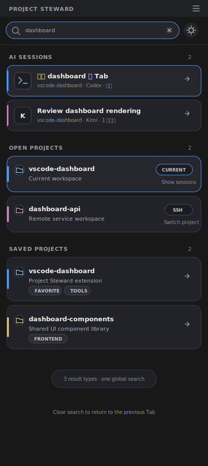
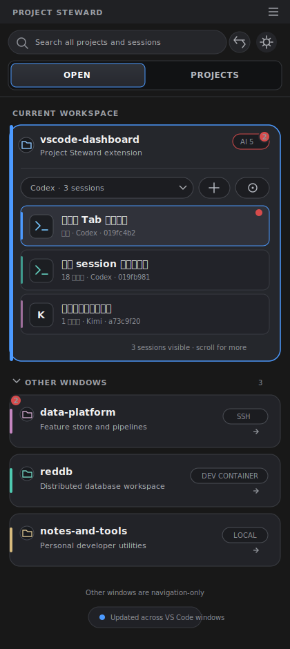
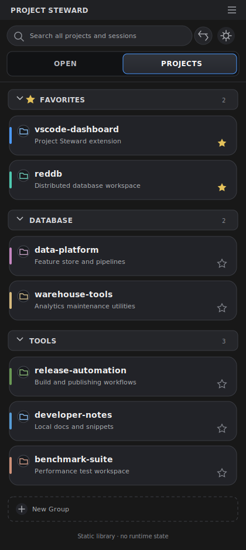

# OPEN / PROJECTS 双 Tab 产品设计

日期：2026-07-15

状态：已确认，待实现

## 1. 背景

Project Steward 最初主要承担“保存、分组和打开项目”的项目库职责。随着当前窗口 AI session、session attention，以及跨 VS Code 窗口的已打开项目陆续加入，侧边栏开始同时承载两类性质不同的信息：

1. **实时工作状态**：当前窗口项目、AI sessions、attention，以及其他窗口中正在打开的项目。
2. **静态项目资产**：Favorites、项目组和已保存项目。

当前实现把 `OPEN PROJECT` 作为 sticky group 放在项目组上方。当打开窗口或 AI sessions 增多时，这一区域会持续占据侧边栏顶部，项目库被推到下方。用户既难以快速查看所有运行中项目，也需要频繁滚动才能访问收藏和项目组。

本设计将实时工作区与静态项目库拆分为两个同级 Tab，让有限的纵向空间一次只服务一个明确任务。

## 2. 设计目标

- 打开侧边栏后，可以快速查看当前项目的 AI session 状态。
- 可以看到当前 VS Code Profile 中其他窗口正在打开的项目，并快速切换过去。
- Favorites、项目组和项目卡片拥有独立、稳定的浏览与搜索空间。
- 分页后不扩大跨窗口数据协议，不扫描其他窗口的 AI session。
- 保留现有项目卡片、AI session 和项目组的主要交互能力。
- 在窄侧边栏中保持清晰的信息层级和可控的滚动长度。

## 3. 非目标

- 不在其他 VS Code 窗口卡片中展示 session 明细、名称或 provider；只使用现有跨窗口 attention aggregate 展示项目级未读数量。
- 不在 `PROJECTS` 中展示当前工作区、已打开状态或 attention。
- 不精确聚焦某一个 VS Code 窗口；点击其他项目仍复用现有项目打开逻辑。
- 不把两个页面拆成两个可独立移动的 VS Code 原生 View。
- 不修改项目、session 或跨窗口注册数据的持久化格式。
- 本文档不包含代码实现方案；产品形态通过评审后再编写实现计划。

## 4. 产品定位

两个 Tab 分别回答两个问题：

| Tab | 用户问题 | 内容性质 |
| --- | --- | --- |
| `OPEN` | 我现在打开了什么，当前 AI 工作进展如何？ | 实时、临时、与窗口状态相关 |
| `PROJECTS` | 我保存了哪些项目，下一步想打开哪个？ | 静态、长期、由用户维护 |

`OPEN` 是默认工作台，`PROJECTS` 是项目资料库。`OPEN` 比 `RUNNING` 更准确地表达“已打开项目”，避免与 VS Code 的运行任务或调试进程混淆。两页不重复展示同一套运行状态。

## 5. 全局页面结构

```text
┌──────────────────────────────────┐
│ Search...       Collapse  Settings│  全局工具栏
├──────────────────────────────────┤
│         OPEN      PROJECTS        │  Tab 导航
├──────────────────────────────────┤
│                                  │
│ 当前 Tab 内容                    │  独立滚动区域
│                                  │
└──────────────────────────────────┘
```

### 5.1 全局工具栏

- 搜索框、展开/折叠全部按钮和设置按钮位于第一行，并在内容滚动时保持可见。
- 设置按钮在所有页面状态下执行相同操作，始终打开 Project Steward 设置。
- 展开/折叠全部按钮在普通状态下只作用于当前 active Tab：
  - `OPEN`：折叠或展开 `OTHER WINDOWS`；`CURRENT WORKSPACE` 始终可见，项目卡片的 AI session 展开状态继续由卡片自身控制。
  - `PROJECTS`：折叠或展开 Favorites 和所有普通项目组。
- 两个 Tab 分别保存自己的分组折叠状态。切换 Tab 后，按钮图标、tooltip 和 `aria-label` 根据新页面的状态立即更新。
- `OPEN` 没有 `OTHER WINDOWS` 时禁用展开/折叠按钮并设置 `aria-disabled="true"`；tooltip 说明当前没有可折叠的其他窗口项目。
- `OPEN` 的按钮 tooltip 使用 `Collapse Other Windows` / `Expand Other Windows`，`PROJECTS` 使用 `Collapse All Groups` / `Expand All Groups`。
- 搜索状态下隐藏展开/折叠全部按钮，避免用户把刚刚筛选出的结果全部折叠；设置按钮继续显示。

### 5.2 Tab 导航

- Tab 位于全局工具栏下方，并与工具栏一起在内容滚动时保持可见。
- 标签固定使用 `OPEN` 和 `PROJECTS`，与插件现有英文 UI 保持一致。
- 首次打开默认选择 `OPEN`。
- 用户切换后，在当前 VS Code 窗口内记住上次选择；关闭再打开侧边栏时恢复该选择。
- 不跨 VS Code 窗口同步选中状态，避免一个窗口的操作改变另一个窗口的页面。
- Tab 本身不展示 attention 红点或数量。

### 5.3 全局搜索模式



- 搜索不是当前 Tab 的局部过滤，而是一个独立的全局结果状态。
- 搜索框为空时显示 Tab 导航，并只展示当前 active Tab 的内容。
- 输入搜索词后隐藏 Tab 导航和展开/折叠全部按钮，同时搜索 `OPEN` 和 `PROJECTS` 中的全部内容。
- 搜索范围包括：
  - 当前项目名称、描述和当前项目的 AI session 名称；
  - 其他窗口项目的名称和描述；
  - Favorites 与普通项目组中的项目名称、描述及现有可搜索字段。
- 搜索结果按行为分为三个固定区域：
  - `AI SESSIONS`：直接展示名称匹配的当前窗口 session row，不受项目卡片是否展开或当前 provider 选择影响；点击后恢复对应 session。
  - `OPEN PROJECTS`：展示匹配的当前工作区和其他窗口项目。点击当前工作区结果会清空搜索、切换到 `OPEN` 并展开对应项目；点击其他窗口结果直接切换或打开项目。
  - `SAVED PROJECTS`：展示匹配的已保存项目并按规范化项目 URI 去重；点击后打开项目。
- `SAVED PROJECTS` 的去重结果使用 badge 展示它所属的 Favorites 和项目组，不重复渲染多张相同卡片。
- 各区域沿用自身页面中的排序规则；没有结果的区域不显示。
- 清空搜索词后退出搜索状态，恢复搜索前的 active Tab、分组折叠状态、卡片展开状态和滚动位置。
- `Ctrl/Cmd+F` 继续聚焦同一个全局搜索框，`Escape` 和清除按钮退出搜索状态。

## 6. OPEN 页面



### 6.1 信息结构

```text
OPEN
├── CURRENT WORKSPACE
│   └── 当前窗口项目卡片（一个或多个 workspace root）
│       └── AI sessions
└── OTHER WINDOWS
    └── 其他窗口项目导航卡片
```

`CURRENT WORKSPACE` 是工作台的核心状态区，始终可见。用户仍可通过项目卡片自身展开或收起 AI sessions。`OTHER WINDOWS` 是可折叠 section，由全局工具栏中的展开/折叠全部按钮控制。

### 6.2 当前工作区

- 当前窗口项目始终位于最前面。
- 多根工作区中的每个 root 继续使用独立项目卡片。
- 卡片保留当前工作区高亮、项目颜色、名称和描述。
- 点击卡片主体展开或收起 AI sessions。
- 保留 provider 选择、新建 session、管理、置顶、重命名、归档和恢复 session 等现有能力。
- attention 红点和数量仅在当前项目卡片及其 session row 内显示。
- `OPEN` Tab、其他窗口导航卡和 `PROJECTS` 页面都不复制该提醒。

### 6.3 Attention 展示边界

AI attention 红点只显示在 `OPEN` 动态页面：当前工作区显示项目级数量和具体 session 红点，其他窗口项目显示项目级数量，帮助用户判断应该切换到哪个窗口继续交互。静态项目库和全局搜索不复制红点：

| 页面或区域 | 显示 attention 红点 |
| --- | --- |
| `OPEN → CURRENT WORKSPACE → 当前项目卡片` | 是 |
| `OPEN → CURRENT WORKSPACE → session row` | 是 |
| `OPEN → OTHER WINDOWS → 项目导航卡片` | 是，仅显示项目级未读 session 数量 |
| `OPEN` / `PROJECTS` Tab 标签 | 否 |
| `PROJECTS` 中的 Favorites、项目组和项目卡片 | 否 |
| 全局搜索结果 | 否 |

该限制只约束红点的展示位置，不改变 attention 后台监控。用户停留在 `PROJECTS` 或全局搜索状态时，所有活动窗口发布的 attention 仍可更新；返回 `OPEN` 后在对应当前项目卡片、session row 或其他窗口导航卡中显示最新状态。

### 6.4 其他窗口

- 只展示当前 VS Code Profile 中，由其他活动窗口发布的去重项目。
- 使用紧凑导航卡，不使用可展开的完整 AI 项目卡。
- 卡片展示：
  - 项目名称；
  - 项目描述或路径摘要；
  - `Local`、`SSH`、`WSL`、`Dev Container` 或 `Remote` 环境标识；
  - 该项目需要处理的未读 AI session 数量 badge；
  - 切换项目的 hover 提示。
- 卡片不展示：
  - AI session 数量或列表；
  - session 名称、provider 或具体 attention 原因；
  - Save、Favorite、颜色编辑、删除和上下文菜单；
  - 当前工作区高亮。
- attention badge 使用现有全局 aggregate 中按隐私安全 project key 聚合的不同未读逻辑 session 数，不要求其他窗口重新扫描 session，也不扩展 open-project 协议。
- 新 attention 到达时，导航卡和 badge 沿用现有有限次数闪烁动画；动画结束后 badge 持续显示，直到对应 session 被确认。
- 排序继续使用现有规则：当前窗口项目优先，其他项目按最近聚焦窗口时间倒序排列。
- 同一规范化项目 URI 只展示一次；如果当前窗口已经包含该项目，不再显示导航副本。
- 同一项目由多个窗口发布时，导航卡仍只显示一次，badge 聚合该项目全部未确认逻辑 sessions。
- 点击卡片继续通过现有 `openProject` / `vscode.openFolder` 路径切换或打开项目。该操作不确认或清除 attention；切换到目标窗口后，badge 继续显示在目标窗口的当前项目卡片中，直到用户点击或处理具体 session。

### 6.5 页面状态

| 状态 | 表现 |
| --- | --- |
| 当前窗口有项目，其他窗口无项目 | 只显示 `CURRENT WORKSPACE`，不渲染空的 `OTHER WINDOWS` 区域 |
| 当前窗口和其他窗口都有项目 | 展示两个区域，其他窗口使用紧凑卡片 |
| 当前窗口无工作区，其他窗口有项目 | 提示当前窗口未打开文件夹，同时展示 `OTHER WINDOWS` |
| 所有窗口都无项目 | 展示“打开文件夹后查看运行项目”的空状态 |
| 其他窗口项目过期或关闭 | 按现有 lease/聚合刷新移除卡片，不影响当前项目 |
| 点击项目时项目刚刚失效 | 沿用现有错误提示并刷新 `OPEN` 页面 |
| 搜索无结果 | 在全局搜索状态显示无匹配结果，保留搜索框和清除入口 |

## 7. PROJECTS 页面



### 7.1 信息结构

```text
PROJECTS
├── FAVORITES
├── 用户项目组 A
├── 用户项目组 B
└── NEW GROUP
```

### 7.2 页面职责

- `PROJECTS` 是静态收藏、组织和搜索项目的空间。
- 保留 Favorites、普通项目组、项目卡片和新增项目组入口。
- 保留项目打开、收藏/取消收藏、编辑、删除、颜色、拖拽排序和跨组移动等现有能力。
- 保留项目组展开/折叠、重命名、删除和拖拽能力。
- 项目库数据为空时，沿用现有导入数据或新增项目引导。

### 7.3 静态状态原则

`PROJECTS` 中的项目卡片不展示任何运行态信息：

- 不展示 AI attention 红点或数量；
- 不展示 AI session 数量；
- 不展示当前工作区高亮；
- 不标记项目是否已在其他窗口打开；
- 不因为 `OPEN` 状态变化而改变排序或视觉。

同一项目可以同时出现在 `OPEN` 和 `PROJECTS`，但含义不同：前者代表当前打开实例，后者代表用户保存的项目资产。

该规则明确覆盖此前“当前工作区高亮同步到普通 Group 和 Favorites”的行为。实现时只保留 `OPEN` 当前工作区卡片的高亮，避免项目库重新混入运行态。

## 8. 交互与状态保持

### 8.1 Tab 切换

1. 用户点击另一个 Tab。
2. 页面立即切换，不重新加载整个 Webview。
3. 原 Tab 的滚动位置、分组折叠状态和卡片展开状态在本次 Webview 生命周期内保留。
4. 选中的 Tab 在当前 VS Code 窗口中持久化，侧边栏重新打开时恢复。

### 8.2 搜索状态切换

1. 用户在顶部搜索框输入非空内容。
2. Tab 导航和展开/折叠全部按钮隐藏，页面切换为包含 `AI SESSIONS`、`OPEN PROJECTS` 和 `SAVED PROJECTS` 的统一搜索结果。
3. 用户点击不同类型的结果时，分别执行恢复 session、展开当前项目、切换已打开项目或打开已保存项目。
4. 用户清空搜索词或按 `Escape`。
5. Tab 导航和展开/折叠全部按钮重新显示，恢复搜索前的 active Tab 及其滚动、折叠和卡片展开状态。

### 8.3 数据刷新

- `OPEN` 继续响应当前项目 session 更新和跨窗口项目聚合更新。
- `PROJECTS` 只响应用户对项目库的增删改、排序和配置变化。
- 后台数据刷新不得强制切换当前 Tab、退出搜索状态、清空搜索词或重置滚动位置。
- `PROJECTS` 可见时，`OPEN` 的数据仍可更新，但不在 `PROJECTS` Tab 或卡片上产生提醒。

### 8.4 键盘与可访问性

- Tab 使用标准 `tablist`、`tab` 和 `tabpanel` 语义。
- `Left` / `Right` 在获得焦点的 Tab 间移动，`Enter` / `Space` 激活。
- 选中 Tab 使用 `aria-selected="true"`，内容区域由 `aria-controls` 关联。
- Tab、搜索框、设置和展开/折叠全部按钮具有可见焦点样式。
- 颜色不是区分 Tab 选中状态和 attention 的唯一手段。

## 9. 视觉规范

- 延续当前 VS Code 主题变量，不写死仅适用于深色主题的产品代码颜色。
- 第一行沿用现有搜索框、展开/折叠全部和设置按钮的紧凑工具栏布局。
- 第二行使用紧凑 segmented control 形式的 Tab 导航，选中态有背景、边框和较高文字对比度。
- 全局工具栏和 Tab 导航组成统一 sticky header，避免产生第三层大型标题。
- 搜索状态下隐藏第二行 Tab 导航和展开/折叠全部按钮，搜索结果紧接全局工具栏显示。
- `CURRENT WORKSPACE` 和 `OTHER WINDOWS` 使用小号 section label，不复用现有大尺寸 group 标题。
- `CURRENT WORKSPACE` 不显示折叠箭头；`OTHER WINDOWS` 显示明确的折叠箭头。
- 当前项目卡片保持现有圆角、边框、色条和展开 session 结构。
- 其他窗口卡片高度接近普通紧凑项目卡，只增加弱化的环境 badge。
- `PROJECTS` 沿用现有卡片与项目组视觉，Tab 改造不重新设计项目库。
- 窄宽度下优先截断项目描述和路径，不压缩 Tab、环境 badge 或主要点击区域。

## 10. 渲染与兼容性约束

### 10.1 渲染性能

- 首次打开侧边栏时优先渲染 active Tab，不要求为了全局搜索而预先挂载两个页面的完整卡片 DOM。
- 全局搜索应基于轻量搜索索引生成匹配结果，只渲染命中的 session、打开项目和已保存项目。
- 切换 Tab 或进入搜索状态不得触发无关 AI provider 历史扫描；其他窗口项目继续保持 navigation-only。
- OTHER WINDOWS attention 通过 navigation card 的规范化项目路径计算隐私安全 project key，并与现有 attention aggregate 做前端投影连接；不得把 session 明细加入 open-project publication。
- `OPEN` 的增量更新只替换对应项目或 section，不得重建整个 Webview，也不得重置 `PROJECTS` 状态。
- 用户首次访问另一个 Tab 后，其滚动和折叠状态在当前 Webview 生命周期内保留。

### 10.2 自定义 CSS 兼容

- 尽量保留现有 `.project`、`.project-container`、`.group`、`.group-title` 和 AI session 相关 class，降低已有 `projectSteward.customCss` 失效概率。
- 新增稳定的 Tab、tabpanel、搜索结果区域和 `OPEN` section class，避免依赖偶然 DOM 层级。
- 依赖旧 `.steward-sticky-header > .sticky-groups-wrapper` 层级的自定义 CSS 可能受影响，发布说明必须明确这是布局结构变化。
- 自定义 CSS 不得改变 Tab、搜索结果和项目操作的语义或数据权限。

## 11. 产品验收标准

1. 用户无需滚过项目组即可查看当前项目 AI sessions 和其他窗口项目。
2. `OPEN` 与 `PROJECTS` 可以在一次点击内相互切换。
3. 首次打开显示 `OPEN`，后续在当前窗口恢复上次 Tab。
4. 当前项目所有 AI session 功能和 attention 表现保持不变。
5. 其他窗口项目只表现为紧凑导航卡，不触发 session 扫描，但显示项目级未读 attention 数量。
6. Attention 红点只显示在 `OPEN` 动态页面：Current Workspace 显示项目 badge 和 session row 红点，Other Windows 显示项目 badge；Tab、PROJECTS 和全局搜索结果均不显示。
7. 顶部搜索同时覆盖 `OPEN` 和 `PROJECTS`；搜索期间隐藏 Tab 和展开/折叠全部按钮，清空后恢复搜索前页面状态。
8. Session 搜索直接展示匹配 row，不受原项目展开状态和 provider 选择影响。
9. Saved Project 搜索结果按规范化 URI 去重，并显示 Favorites/项目组归属。
10. 展开/折叠全部按钮在 `OPEN` 只控制 `OTHER WINDOWS`，在 `PROJECTS` 控制 Favorites 和普通项目组。
11. 项目组折叠、拖拽、收藏和编辑能力在 `PROJECTS` 中保持可用。
12. 跨窗口项目增删不会重置 Tab、搜索词、滚动位置或当前项目 session 展开状态。
13. Local、SSH、WSL、Dev Container 和其他 Remote 项目均能在 `OPEN` 中显示正确环境标识并复用现有打开逻辑。
14. 首次打开只需完成 active Tab 的主要渲染；全局搜索和 `OPEN` 增量更新不得触发整个 Webview 重建。
15. 现有项目卡片、项目组和 AI session 的核心 CSS class 保持可用，已知层级兼容变化写入发布说明。
16. 点击带 attention 的 Other Windows 卡片只切换项目，不确认事件；目标窗口继续显示红点，直到具体 session 被处理。

## 12. 评审重点

- `OPEN` 与 `PROJECTS` 的职责划分是否符合实际使用频率。
- 当前工作区完整卡片与其他窗口紧凑卡片的视觉层级是否足够明确。
- `PROJECTS` 完全静态、不展示运行态的原则是否需要调整。
- 全局工具栏、Tab 导航和搜索状态切换是否直观。
- 效果图中的信息密度是否适合常用的 VS Code 侧边栏宽度。
