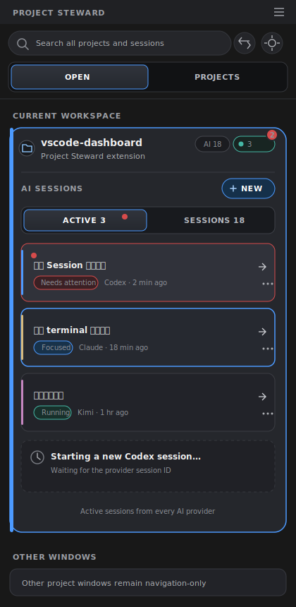
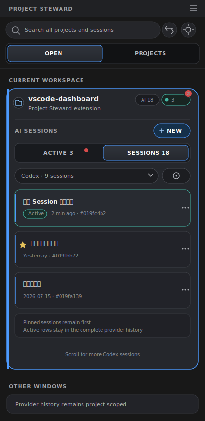
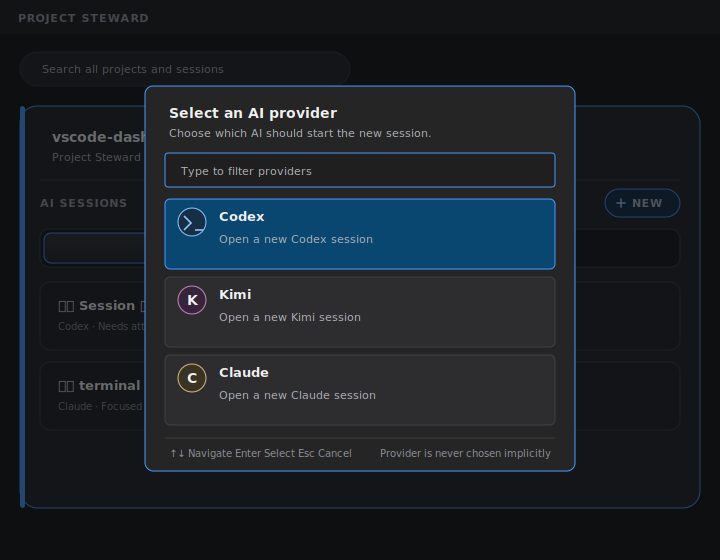

# AI Session Management Tabs PRD

日期：2026-07-18

状态：产品设计已确认，待实现计划

## 1. 文档摘要

Project Steward 当前把一个 provider 的全部 AI Session 放在同一列表中。正在通过 VS Code Terminal 运行的 Session、当前聚焦的 Session、等待用户处理的 Session，以及尚未打开的历史 Session 混在一起。用户需要阅读名称、时间和 Terminal 状态，才能判断“哪些 AI 工作现在正在进行”。

本设计在当前项目卡片内部增加 `ACTIVE / SESSIONS` 双 Tab：

- `ACTIVE` 是跨 provider 的实时工作台，汇总当前窗口中已经绑定到存活 Terminal 的 Codex、Kimi 和 Claude Session。
- `SESSIONS` 是完整资料库，保留现有 provider 选择器和全部历史 Session，并继续包含 Active Session。
- `+ NEW` 从 provider 列表的附属按钮提升为两个 Tab 共享的主操作。每次新建都由用户明确选择 provider。

两个 Tab 不互斥。Active Session 同时存在于 `ACTIVE` 和 `SESSIONS`：前者回答“现在什么正在工作”，后者保证“历史资料库完整”。

## 2. 背景与问题

### 2.1 当前体验

当前项目卡片展开后，AI Session 区域由以下元素组成：

1. provider 选择器，例如 `Codex (9)`；
2. 根据当前 provider 创建 Session 的加号按钮；
3. 当前 provider 的完整 Session 列表；
4. 管理与批量归档入口。

列表可以高亮当前聚焦 Terminal，也可以显示 attention，但用户仍需要在三个 provider 之间切换，才能回答这些高频问题：

- 当前到底有多少个 AI Session 已经打开？
- 哪些 Session 正在运行，哪些需要我处理？
- 我刚才打开的 Claude Session 在哪里？
- 点击历史 Session 会聚焦已有 Terminal，还是再开一个 Terminal？
- 点击加号会创建哪一种 AI Session？

### 2.2 根本问题

当前界面把两类性质不同的信息放在同一层级：

| 信息类型 | 用户问题 | 数据性质 |
| --- | --- | --- |
| Active Session | 现在有哪些 AI 工作正在当前窗口中运行？ | 实时、短期、跨 provider |
| Session History | 这个项目保存了哪些可恢复的 Session？ | 历史、长期、按 provider 管理 |

provider 是历史资料的天然分类方式，但不是实时工作的最佳入口。用户管理 Active Session 时关心的是工作状态，不应该先记住它属于 Codex、Kimi 还是 Claude。

### 2.3 与 Project 管理的类比

Project Steward 已使用外层 `OPEN / PROJECTS` 拆分运行态和静态资料库：

- `OPEN` 展示当前打开的工作区；
- `PROJECTS` 展示完整的已保存项目库。

本设计把同一原则应用到项目卡片内部，但保留一个重要差异：`SESSIONS` 必须是完整历史，因此 Active Session 不从历史列表中移除。

## 3. 产品目标

1. 用户展开项目卡片后，一次点击内看到所有 provider 的 Active Session。
2. 用户无需记住 Active Session 属于哪个 provider。
3. 用户能够明确区分 `Starting`、`Running`、`Focused`、`Needs attention` 和普通历史记录。
4. 用户从完整历史恢复 Session 时，不会打开重复 Terminal。
5. 用户从任意 Tab 新建 Session 时，都能明确控制使用哪个 AI provider。
6. 保留现有 Session 历史、Pin、Rename、Copy ID、Archive 和批量管理能力。
7. 在常见的 260–400px VS Code 侧边栏宽度内保持主要操作可见。
8. 状态刷新不得重建整个 Dashboard，也不得重置用户当前视图。

## 4. 非目标

- 不把三个 provider 的历史 Session 合并为一个无限列表。
- 不同步、索引或显示 Session 对话内容。
- 不把其他 VS Code 窗口的 Active Session 明细传入当前窗口。
- 不引入 tmux、后台守护进程或跨主机重启保活。
- 不改变 Codex、Kimi、Claude 自身的 Session 存储格式。
- 不在第一版提供暂停、重启或批量关闭 Active Session。
- 不重新设计外层 `OPEN / PROJECTS`、`CURRENT WORKSPACE` 或 `OTHER WINDOWS`。
- 不在第一版建立新的产品遥测服务。

## 5. 关键产品定义

### 5.1 Active Session

Active Session 是当前项目中已经绑定到现存 VS Code Terminal，且尚未结束、关闭或释放的逻辑 AI Session。

- 一个项目可以同时有多个 Active Session。
- Active 不等于当前聚焦；当前聚焦是 Active 的一个视觉状态。
- Active 不等于最近更新；仅有历史文件变化不能使 Session 变为 Active。
- 新建中但尚未获得真实 Session ID 的 Terminal 使用临时 `Starting` Active 项表示。
- 同一个逻辑 Session 即使有恢复中的映射，也只能显示一行。

### 5.2 Complete Session History

`SESSIONS` 展示当前 provider 属于当前项目的全部可见 Session，包括 Active Session。

Active Session 不从历史列表移除，因为 `SESSIONS` 的职责是提供完整、稳定、可管理的资料库。

### 5.3 Attention

Attention 表示 AI 已完成阶段工作或可能需要用户输入。它与 Active 是两个维度：

- Active：Terminal 是否仍作为当前运行工作存在；
- Attention：用户是否需要查看或处理该 Session。

视觉上必须使用不同颜色、图标、文字和 tooltip，不能把两者合并成一个状态。

## 6. 方案选择

本次评审比较了三个方向：

1. **非对称双 Tab**：`ACTIVE` 汇总所有 provider，`SESSIONS` 保留 provider 筛选。
2. **共享 provider 筛选器**：一个筛选器同时控制两个 Tab。
3. **两个 Tab 都跨 provider 汇总**：`SESSIONS` 再增加 provider chips。

最终选择方案 1。原因是：

- Active 数量通常较少，跨 provider 汇总能够直接回答“现在什么正在工作”；
- 历史数量可能很大，继续按 provider 管理可以保留熟悉的工作流；
- 方案对现有 Session 列表和批量管理的改动最小；
- New Session 可以自然脱离 provider 筛选，成为共享动作。

## 7. 总体信息架构

```text
OPEN
└── CURRENT WORKSPACE
    └── 当前项目卡片
        ├── 项目摘要
        └── AI SESSIONS
            ├── 共享操作：+ NEW
            ├── ACTIVE
            │   └── 全部 provider 的 Active Session
            └── SESSIONS
                ├── provider 选择器
                ├── Manage
                └── 当前 provider 的完整 Session 历史
```

项目卡片展开后的结构：

```text
┌─────────────────────────────────────┐
│ vscode-dashboard              AI 18 │
│ Project Steward extension   ●3   ②  │
├─────────────────────────────────────┤
│ AI SESSIONS                  + NEW  │
│ ┌──────────────┬──────────────────┐ │
│ │ ACTIVE 3     │ SESSIONS 18      │ │
│ └──────────────┴──────────────────┘ │
│                                     │
│ 当前 Tab 内容                       │
└─────────────────────────────────────┘
```

### 7.1 共享模块标题

- 使用固定标题 `AI SESSIONS`。
- `+ NEW` 位于标题右侧，在两个 Tab 中始终可见。
- `+ NEW` 使用图标和文字，不使用只有加号的无标签按钮。
- provider 工具栏不再承载 New Session。

### 7.2 Tab 标签与计数

- `ACTIVE n`：当前项目的 Active 逻辑 Session 数。
- `SESSIONS n`：三个 provider 的全部历史 Session 总数，包括 Active Session。
- Tab 数量不因当前 provider 筛选而变化。
- `ACTIVE` 中存在 attention 时，Tab 标签显示一个小红点，但不增加第三个数字。

### 7.3 默认 Tab

首次展开某个项目卡片时：

- Active 数量大于 0：默认 `ACTIVE`；
- Active 数量为 0：默认 `SESSIONS`。

用户手动切换后，按项目、按当前 VS Code 窗口记住选择。后续 Active 数量变化不得自动切换 Tab。

唯一例外是用户明确完成 New Session 创建：界面切换到 `ACTIVE` 并展示新建项。

## 8. ACTIVE Tab



### 8.1 页面职责

`ACTIVE` 是当前项目的实时 AI 工作台。它跨 provider 汇总 Session，不显示 provider 筛选器。

### 8.2 Session 状态

| 状态 | 含义 | 视觉优先级 |
| --- | --- | --- |
| `Starting` | Terminal 已创建，真实 Session ID 尚未发现 | 使用等待图标和临时文案 |
| `Running` | Session 已绑定到存活 Terminal | 中性运行态标签 |
| `Focused` | 对应 Terminal 当前获得 VS Code 焦点 | 聚焦边框或强调背景 |
| `Needs attention` | AI 等待用户输入或产生需处理事件 | 红点与状态文字，优先于 Focused 文案 |

`Focused` 是视觉状态，`Needs attention` 是任务状态。两者可以同时存在。此时行保留聚焦边框，但状态文字显示 `Needs attention`。

### 8.3 排序

固定排序规则：

1. `Needs attention`；
2. 当前 `Focused`；
3. 其他 Active Session，按最近活动时间倒序；
4. `Starting` 保留在用户触发新建时的位置，绑定完成后进入正常排序。

排序只在排序键真实变化时更新。纯时间文案刷新不得造成列表跳动。

### 8.4 Session 行

每行展示：

- Session 名称；
- provider 图标、颜色和文字；
- 当前状态；
- 最近活动时间；
- 在宽度允许时显示短 Session ID；
- 聚焦入口和更多菜单。

整行是主要点击目标。点击后聚焦已有 Terminal，不创建重复 Terminal。

### 8.5 行操作

更多菜单包含：

- `Focus Terminal`
- `Rename`
- `Pin Session` / `Unpin Session`
- `Copy Session ID`
- `Close Terminal…`

`Starting` 状态禁用 `Copy Session ID`。

`Close Terminal…` 必须提示：关闭 Terminal 可能中止正在运行的 AI 任务。用户确认后关闭 Terminal，但不归档 Session。关闭成功后，该项从 `ACTIVE` 移除，并继续保留在 `SESSIONS`。

`ACTIVE` 不提供 Archive，避免用户在运行态直接改变 provider 历史。

### 8.6 空状态

```text
No active sessions
Start a new AI session or open one from Sessions.

[ New Session ]   [ View Sessions ]
```

- `New Session` 启动共享新建流程。
- `View Sessions` 切换到 `SESSIONS`，不改变 provider 选择。

## 9. SESSIONS Tab



### 9.1 页面职责

`SESSIONS` 是当前项目的完整 Session 资料库。它保留现有 provider 选择器、Pin、Rename、Copy ID、Archive 和批量管理能力。

### 9.2 Provider 工具栏

- provider 选择器保留 `Codex / Kimi / Claude` 和各自数量。
- 数量包含该 provider 的 Active Session。
- Manage 只管理当前选中 provider。
- provider 选择器和 Manage 位于 Tab 下方。
- 不在工具栏中重复 `+ NEW`。
- `ACTIVE` 和 `SESSIONS` 分别保存自己的视图状态；`ACTIVE` 当前没有 provider 筛选状态。

### 9.3 历史排序

- Pinned Session 优先；
- 其余按更新时间倒序；
- Active 状态不改变历史排序，避免 Session 因打开或关闭而跳动。

### 9.4 Active Session 在历史中的表现

- Active Session 继续出现在完整历史中。
- 行内显示中性的 `Active` 标签和 provider 强调色。
- 点击 Active Session：聚焦已有 Terminal。
- 点击非 Active Session：创建或复用 Terminal 并恢复 Session；成功后加入 `ACTIVE`。
- Rename、Pin 和 Copy ID 的结果在两个 Tab 中同步。
- Active Session 的 Archive 入口禁用，并显示 `Close the active terminal before archiving.`。

### 9.5 管理模式

- 只管理当前 provider。
- Active Session 的批量选择框禁用。
- `Select all unpinned` 不选择 Active Session。
- 批量计数不包含禁用项。
- 批量归档期间保留 Tab、provider、滚动位置和已选状态。
- 完成后只移除归档成功的项；失败项保留，并显示成功、失败和跳过数量。

### 9.6 空状态

| 条件 | 文案与行为 |
| --- | --- |
| provider 可用但无历史 | `No Codex sessions yet`，保留共享 New Session |
| provider 历史不可用 | `Codex session history is unavailable in this environment` |
| 当前 provider 无历史，但其他 provider 有历史 | 显示弱提示，不自动切换 provider |

## 10. New Session



### 10.1 产品原则

New Session 表达“选择一个 AI 开始工作”，不是“向当前 provider 列表添加记录”。它独立于：

- 当前内层 Tab；
- `SESSIONS` 当前 provider；
- 最近使用的 provider；
- 当前聚焦的 Active Session。

### 10.2 流程

```text
点击 + NEW
    ↓
VS Code Quick Pick：选择 provider
    ├── Codex
    ├── Kimi
    └── Claude
    ↓
输入可选标题
    ↓
创建并聚焦 Terminal
    ↓
切换到 ACTIVE，显示 Starting
    ↓
发现真实 Session ID，原地升级
```

### 10.3 Provider Picker

- 使用 VS Code 原生 Quick Pick。
- 标题：`Select an AI provider`。
- 每项包含 provider 名称和说明，例如 `Open a new Codex session`。
- 每次新建必须由用户明确选择 provider。
- 可以把最近使用的 provider 排在首位，但不能自动执行。
- provider 不可用时保留在列表中，置灰并说明原因。
- 不可用 provider 不能选择。
- Quick Pick 和后续 Input Box 使用 `ignoreFocusOut`。
- 取消任一步骤都不创建 Terminal。

### 10.4 标题输入

- 继续使用可选标题输入框。
- prompt 根据已选 provider 显示，例如 `New Codex chat title (optional)`。
- 空标题继续由 provider Session ID 或现有回退规则命名。
- 标题输入需要沿用现有清理和长度规则。

### 10.5 Starting 项

- Terminal 创建成功后立即切换到 `ACTIVE`。
- 使用临时 creation ID 插入 `Starting` 行。
- 获得真实 Session ID 后原地替换身份和内容，不新增第二行。
- 绑定期间不把临时项写入 provider 历史。
- 绑定失败或超时后移除临时行，显示 `Could not detect the new session`。
- 超时不能擅自关闭已经创建的 Terminal；通知提供 `Focus Terminal`。
- Quick Pick 或标题输入流程尚未结束时，忽略重复 `+ NEW` 请求。

## 11. 项目卡片摘要

项目卡片收起时仍应表达三种不同信息：

```text
AI 18   ACTIVE 3   ②
```

窄宽度压缩为：

```text
AI 18   ●3   ②
```

| 元素 | 含义 | 视觉 |
| --- | --- | --- |
| `AI 18` | 全部历史 Session 数 | 中性 badge |
| `ACTIVE 3` / `●3` | 当前 Active Session 数 | 中性运行态颜色 |
| 红色 `②` | attention 数量 | 错误/提醒色 |

- Active 和 attention 不使用同一种颜色。
- 三种摘要都有独立 tooltip 和可访问名称。
- 点击摘要不单独触发动作；点击项目卡片继续展开或收起。
- 空计数不显示对应摘要，减少视觉噪音。

## 12. 状态同步与用户状态保持

### 12.1 Tab 状态

- 按项目、按 VS Code 窗口保存选中 Tab。
- 切换项目或卡片时分别恢复状态。
- Active 数量变化不自动切换用户已经选择的 Tab。
- 卡片收起再展开恢复原 Tab。
- Webview 重建后恢复持久化选择；无法恢复时使用自适应默认规则。

### 12.2 Provider 状态

- `SESSIONS` 继续按项目保存当前 provider。
- New Session 的 provider 选择不改变历史筛选器。
- 从 Active 行执行 Rename 或 Pin 后，历史中的同一逻辑 Session同步更新。

### 12.3 滚动与管理状态

- `ACTIVE` 和 `SESSIONS` 分别保存列表滚动位置。
- provider 切换继续使用现有 provider 列表滚动规则。
- 局部数据刷新不得退出 Manage 模式。
- 被删除、归档或失活的行移除后，尽量保持相邻内容的视觉位置。

## 13. 全局搜索

- 全局搜索覆盖所有 provider 的全部 Session，不受内层 Tab 或 provider 选择影响。
- Active 搜索结果显示中性的 `Active` 标签。
- 点击 Active 搜索结果聚焦已有 Terminal。
- 点击非 Active 搜索结果恢复 Session。
- 全局搜索不复制 attention 红点，继续遵循低噪音原则。
- 搜索结束后恢复项目卡片原 Tab、provider、Manage 模式和滚动位置。
- 搜索结果不需要为了判断 Active 而重新扫描 provider 历史；使用当前 Session 投影视图。

## 14. 状态来源与投影模型

`ACTIVE` 不是新的用户维护列表，而是从现有运行态数据实时推导：

```text
Provider 历史记录 ───────┐
Terminal 持久化绑定 ─────┼── Project Session Projection ── Webview
Pending 创建记录 ────────┤
Attention / 焦点状态 ────┘
```

### 14.1 逻辑身份

- 已建立 Session：`provider + sessionId`；
- 新建中的 Session：临时 creation ID；
- 绑定完成时把临时项原地升级为真实身份；
- 历史、Terminal、Pin、Alias、Attention 和焦点信息合并到同一逻辑项。

### 14.2 作用域

- Active 只表示当前 VS Code 窗口、当前扩展宿主中的 Terminal Session。
- 不把其他窗口的 Session 名称、provider、ID 或状态传入当前卡片。
- `OTHER WINDOWS` 继续只使用项目级 attention aggregate。
- Local、SSH、WSL、Dev Container 和其他 Remote 环境由各自扩展宿主管理 Active 状态。

### 14.3 Reload 恢复顺序

1. 恢复持久化 Terminal binding。
2. 清理 process ID 不匹配、Terminal 不存在或 provider 不匹配的记录。
3. 恢复 pending creation。
4. 读取 provider 历史。
5. 生成项目 Session Projection。
6. 计算 Active 数量和默认 Tab。
7. 首次渲染卡片。

必须先恢复 Terminal binding，再计算默认 Tab，避免 reload 后短暂进入错误页面。

## 15. 生命周期

```text
Create → Starting → Active
Resume ───────────→ Active
Active → Focused / Needs attention
Active → Terminal completed, released or closed → 从 ACTIVE 移除
历史记录始终保留在 SESSIONS，除非用户归档
```

### 15.1 进入 Active

- New Session 创建 Terminal；
- 历史 Session 恢复到 Terminal；
- reload 后恢复有效持久化绑定；
- 插件发现由自身管理且可可靠识别的现存 Session Terminal。

### 15.2 离开 Active

- Terminal 被用户关闭；
- provider 进程完成并触发显式释放；
- Terminal binding 被验证为过期或无效；
- 用户确认执行 `Close Terminal…`。

离开 Active 不等于 Archive，也不删除 Alias、Pin 或历史文件。

## 16. 异常与边界场景

| 场景 | 产品行为 |
| --- | --- |
| 聚焦时 Terminal 已消失 | 清理陈旧绑定，提示用户；历史项仍可再次恢复 |
| 恢复 Session 失败 | 保留历史行，显示错误，不加入 Active |
| 关闭 Terminal 失败 | Active 行保留，不做乐观移除 |
| provider 历史暂时不可读 | 保留最后一次成功结果并显示非阻塞提示 |
| Active Terminal 存在但历史不可读 | 显示 provider 和短 ID；名称使用可靠回退值 |
| New Session 绑定超时 | 移除 Starting，保留 Terminal，提供 Focus Terminal |
| Session 在两个刷新间完成 | 一次语义更新完成移除，避免 Active 闪回 |
| 同一 Session 被重复点击 | 聚焦已绑定 Terminal，不创建第二个 Terminal |
| Active Session 被批量归档选择 | 选择框禁用，批量计数忽略该项 |
| 用户关闭当前聚焦 Session | Active 重排，但不自动聚焦其他 Terminal |
| 当前 Tab 中最后一项消失 | 保持当前 Tab 并显示空状态，不自动跳到另一 Tab |
| 不可用 provider 被选择用于 New | Quick Pick 阻止选择并显示原因 |
| 多根工作区 | 每个项目 root 拥有独立 Active 投影和 Tab 状态 |

## 17. 视觉规范

### 17.1 层级

- 内层 Tab 使用紧凑 segmented control，不复制外层 `OPEN / PROJECTS` 的尺寸。
- 两个 Tab 等宽。
- 选中态同时使用背景、边框和高对比文字。
- `+ NEW` 是 Session 模块内唯一强调主操作。
- `ACTIVE` 不显示 provider 工具栏。
- `SESSIONS` provider 工具栏位于 Tab 下方。

### 17.2 Session 行

- 最小点击高度 42px。
- 第一行是名称，单行省略。
- 第二行是 provider、状态、时间和可选短 ID。
- 宽度不足时优先隐藏短 ID，再压缩时间；provider 和状态必须保留。
- 左侧强调条表示 provider。
- 边框或背景表示 Focused。
- 红点和文字表示 Needs attention。
- `Active` 在历史中使用中性胶囊标签，不使用红色。
- 更多菜单在 hover、键盘聚焦或触屏交互时可见。

### 17.3 响应式

- 常规宽度显示完整 `+ NEW`、状态文字和项目摘要。
- 小于约 280px 时压缩项目摘要和次要元数据。
- 不把 Tab 名称替换为图标。
- 不把 `+ NEW` 移入溢出菜单。
- Session 列表继续遵循 `maxVisibleAiSessions` 并使用内部滚动。
- 模块标题、Tab 和 provider 工具栏不随 Session 列表滚动。

### 17.4 主题

- 使用 VS Code theme tokens，不写死仅适用于深色主题的产品代码颜色。
- 验证深色、浅色和高对比主题。
- provider 不只依赖颜色，必须同时显示图标或文字。

## 18. 可访问性

- 内层导航使用 `tablist`、`tab`、`tabpanel`。
- `aria-selected` 和 `aria-controls` 正确关联。
- `Left / Right` 移动 Tab 焦点，`Enter / Space` 激活，`Home / End` 跳到首尾。
- Session 行可获得键盘焦点；`Enter` 执行 Focus 或 Resume。
- 更多菜单支持键盘打开和方向键导航。
- `+ NEW` 的可访问名称为 `New AI Session`。
- Active、Attention、Focused 不只通过颜色表达。
- 数量摘要拥有完整可访问名称，例如 `3 active AI sessions`。
- 状态变化使用克制的 `aria-live` 通知；时间刷新不播报。
- 遵循 `prefers-reduced-motion`，允许禁用插入和 attention 动画。
- 关闭 Terminal 的确认对话框将焦点返回原 Session 行或合理相邻项。

## 19. 性能与渲染约束

- Active 投影复用现有 Terminal binding、pending、attention 和历史数据，不为切换 Tab启动新的文件扫描。
- `ACTIVE` 和 `SESSIONS` 可以由同一个项目级 Session Projection 派生。
- Session 更新只替换受影响的项目卡片或局部列表。
- 不重建 Dashboard，不重置外层 `OPEN / PROJECTS`。
- 时间文案更新不能触发完整列表排序。
- Tab 切换不触发 provider 重新扫描。
- 全局搜索使用当前轻量索引和 Active 标识，不挂载隐藏的完整 Tab DOM。
- provider 历史不可用时不得用空数组覆盖最后一次成功数据。

## 20. 产品成功标准

由于第一版不增加新遥测服务，使用任务完成标准和回归验证评估：

1. 用户展开卡片后，一次点击内找到任意 Active Session。
2. 用户无需先选择 provider 即可看到所有 Active Session。
3. 用户能够通过状态文字正确区分运行中、聚焦中和需要处理。
4. 用户从历史点击 Active Session 时只聚焦 Terminal。
5. 用户每次 New Session 都能明确选择 provider。
6. 在 260–400px 宽度内主要操作不隐藏、不出现横向滚动。
7. reload、provider 刷新和 attention 更新不改变用户手动选择的 Tab。

如果未来已有隐私合规的产品遥测机制，可以评估：

- 从展开卡片到聚焦 Active Session 的交互次数；
- New Session provider picker 的取消率；
- Resume 请求中复用已有 Terminal 的比例；
- Active Tab 与 Sessions Tab 的访问比例。

本文档不要求为了该功能单独引入遥测。

## 21. 测试矩阵

### 21.1 状态与投影

- 无 Active、有历史；
- 有一个 Active；
- 多 provider 同时 Active；
- 同一 Session 同时拥有历史、binding、attention 和 pin；
- Starting 成功升级；
- Starting 超时；
- Terminal 关闭、完成、释放与过期绑定清理；
- reload 前后 Active 身份稳定；
- provider 历史不可用但 Terminal binding 有效。

### 21.2 交互

- 自适应默认 Tab；
- 手动 Tab 选择持久化；
- New Session 成功后切换 Active；
- Active 行 Focus；
- 非 Active 行 Resume；
- Rename、Pin 和 Copy ID 跨 Tab 同步；
- Close Terminal 确认、取消、成功和失败；
- Active Session Archive 禁用；
- 批量选择忽略 Active；
- provider 切换不影响 Active；
- 搜索结果正确区分 Focus 和 Resume。

### 21.3 环境

- Local；
- SSH；
- WSL；
- Dev Container；
- 多根工作区；
- 多 VS Code 窗口；
- 侧边栏隐藏后恢复；
- Extension Host reload。

### 21.4 视觉与可访问性

- 260px、280px、320px、400px 宽度；
- 深色、浅色、高对比主题；
- 键盘完整操作；
- 屏幕阅读器状态名称；
- reduced motion；
- 长 Session 名、非 ASCII 名称和缺失 Alias；
- 0、1、两位数和三位数计数。

## 22. 产品验收标准

1. 当前项目卡片展开后显示 `ACTIVE / SESSIONS` 双 Tab 和共享 `+ NEW`。
2. `ACTIVE` 汇总当前窗口中所有 provider 的存活 Session。
3. `SESSIONS` 保留 provider 选择器，并包含 Active Session。
4. 同一 Active Session 在两个 Tab 中身份和状态一致。
5. 点击 Active Session 聚焦已有 Terminal，不创建重复 Terminal。
6. 点击非 Active 历史 Session 恢复并进入 `ACTIVE`。
7. 有 Active 时首次默认 `ACTIVE`，否则默认 `SESSIONS`。
8. 用户手动选择后，状态变化不抢占 Tab。
9. `+ NEW` 每次要求明确选择 Codex、Kimi 或 Claude。
10. New Session 从 `Starting` 原地升级，不出现重复行。
11. Active Session 不能直接归档，也不能被批量归档选中。
12. `Close Terminal…` 有风险确认，关闭后历史仍保留。
13. reload 后先恢复 Terminal binding，再计算 Active 和默认 Tab。
14. 项目摘要区分全部、Active 和 attention 三种数量。
15. 全局搜索正确选择 Focus 或 Resume 行为。
16. Local、SSH、WSL、Dev Container 和其他 Remote 环境遵循相同语义。
17. 两个 Tab 分别保留滚动位置；刷新不重置 provider、Manage 或展开状态。
18. 窄侧边栏、键盘、屏幕阅读器、高对比主题和 reduced motion 可用。
19. 现有 Rename、Pin、Copy ID、Archive、批量归档和 attention 无回归。
20. 所有 Session 更新使用局部渲染，不重建整个 Dashboard。

## 23. 发布与兼容性

- 保留现有 Session 行的核心 CSS class，并为 Tab、状态和共享操作增加稳定 class。
- 依赖旧 provider 工具栏中加号按钮层级的自定义 CSS 可能受影响，发布说明需要明确。
- 现有 `maxVisibleAiSessions` 继续同时约束两个列表的可见行数。
- 原有 active-terminal 高亮升级为 `Focused` 视觉状态，不改变 Terminal 复用语义。
- 首次升级不迁移 Session 历史；只新增按项目、按窗口的 Tab 视图状态。
- 若视图状态缺失或版本不兼容，使用自适应默认规则安全回退。

## 24. 已确认的产品决策

| 决策 | 结论 |
| --- | --- |
| Active 定义 | 绑定到现存且未释放 VS Code Terminal 的逻辑 Session |
| 两个 Tab 是否互斥 | 不互斥；Sessions 保持完整历史 |
| 默认 Tab | 有 Active 默认 Active，否则默认 Sessions；手动选择后不抢占 |
| Active 的 provider 范围 | 汇总 Codex、Kimi、Claude |
| Sessions 的 provider 范围 | 保留现有单 provider 列表 |
| New Session 位置 | Session 模块共享标题右侧 |
| New Session provider | 每次由用户明确选择 |
| Active 行点击 | 聚焦已有 Terminal |
| Active 中归档 | 不提供 |
| 关闭 Active | 明确确认后关闭 Terminal，历史保留 |
| 其他窗口 | 不传输 Session 明细，保持 navigation-only |
